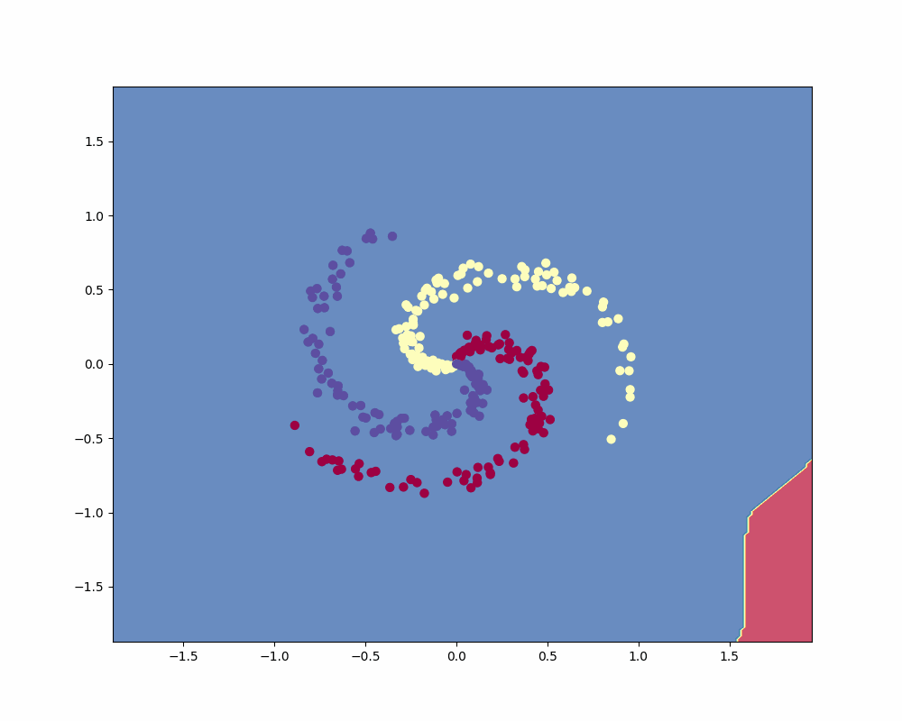

# PyNet

Collection of basic neural network components in a partially modular framework.

This repo draws inspiration from the major DNN frameworks and [TinyDNN](https://github.com/tiny-dnn/tiny-dnn).

This is not meant to be a fully functional platform. The purpose is to serve as a playground for learning the underpinnings of ML and DL.

## Usage
See `nautilus.py` for example usage.

